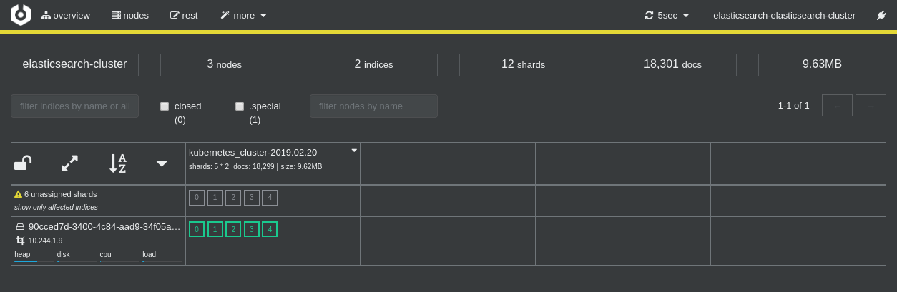

# Install ElasticSearch and Kibana

::: tip
Screencast: [https://asciinema.org/a/229605?t=228](https://asciinema.org/a/229605?autoplay=0&t=228)
:::

Add [ElasticSearch operator](https://github.com/upmc-enterprises/elasticsearch-operator)
to Helm:

```bash
helm repo add es-operator https://raw.githubusercontent.com/upmc-enterprises/elasticsearch-operator/master/charts/
```

Install ElasticSearch operator:

```bash
helm install --wait --name elasticsearch-operator es-operator/elasticsearch-operator --set rbac.enabled=True --namespace es-operator
sleep 20
```

Check how the operator looks like:

```bash
kubectl get svc,deploy,po --namespace=es-operator -o wide
```

Output:

```shell
NAME                                           READY   UP-TO-DATE   AVAILABLE   AGE    CONTAINERS               IMAGES                                          SELECTOR
deployment.extensions/elasticsearch-operator   1/1     1            1           106s   elasticsearch-operator   upmcenterprises/elasticsearch-operator:0.0.12   name=elasticsearch-operator,release=elasticsearch-operator

NAME                                          READY   STATUS    RESTARTS   AGE    IP           NODE                             NOMINATED NODE   READINESS GATES
pod/elasticsearch-operator-5dc59b8cc5-6946l   1/1     Running   0          106s   10.244.1.9   pruzicka-k8s-istio-workshop-node03   <none>           <none>
```

Install ElasticSearch cluster:

```bash
helm install --wait --name=elasticsearch --namespace logging es-operator/elasticsearch \
  --set kibana.enabled=true \
  --set cerebro.enabled=true \
  --set storage.class=rook-ceph-block \
  --set clientReplicas=1,masterReplicas=1,dataReplicas=1
sleep 120
```

Check ElasticSearch components:

```bash
kubectl get svc,deploy,po,pvc,elasticsearchclusters --namespace=logging -o wide
```

Output:

```shell
NAME                                                    TYPE        CLUSTER-IP       EXTERNAL-IP   PORT(S)    AGE   SELECTOR
service/cerebro-elasticsearch-cluster                   ClusterIP   10.105.197.151   <none>        80/TCP     18m   role=cerebro
service/elasticsearch-discovery-elasticsearch-cluster   ClusterIP   10.111.76.241    <none>        9300/TCP   18m   component=elasticsearch-elasticsearch-cluster,role=master
service/elasticsearch-elasticsearch-cluster             ClusterIP   10.104.103.49    <none>        9200/TCP   18m   component=elasticsearch-elasticsearch-cluster,role=client
service/es-data-svc-elasticsearch-cluster               ClusterIP   10.98.179.244    <none>        9300/TCP   18m   component=elasticsearch-elasticsearch-cluster,role=data
service/kibana-elasticsearch-cluster                    ClusterIP   10.110.19.242    <none>        80/TCP     18m   role=kibana

NAME                                                    READY   UP-TO-DATE   AVAILABLE   AGE   CONTAINERS                        IMAGES                                                    SELECTOR
deployment.extensions/cerebro-elasticsearch-cluster     1/1     1            1           18m   cerebro-elasticsearch-cluster     upmcenterprises/cerebro:0.6.8                             component=elasticsearch-elasticsearch-cluster,name=cerebro-elasticsearch-cluster,role=cerebro
deployment.extensions/es-client-elasticsearch-cluster   1/1     1            1           18m   es-client-elasticsearch-cluster   upmcenterprises/docker-elasticsearch-kubernetes:6.1.3_0   cluster=elasticsearch-cluster,component=elasticsearch-elasticsearch-cluster,name=es-client-elasticsearch-cluster,role=client
deployment.extensions/kibana-elasticsearch-cluster      1/1     1            1           18m   kibana-elasticsearch-cluster      docker.elastic.co/kibana/kibana-oss:6.1.3                 component=elasticsearch-elasticsearch-cluster,name=kibana-elasticsearch-cluster,role=kibana

NAME                                                    READY   STATUS    RESTARTS   AGE   IP            NODE                             NOMINATED NODE   READINESS GATES
pod/cerebro-elasticsearch-cluster-64888cf977-dgb8g      1/1     Running   0          18m   10.244.0.9    pruzicka-k8s-istio-workshop-node01   <none>           <none>
pod/es-client-elasticsearch-cluster-8d9df64b7-tvl8z     1/1     Running   0          18m   10.244.1.11   pruzicka-k8s-istio-workshop-node03   <none>           <none>
pod/es-data-elasticsearch-cluster-rook-ceph-block-0     1/1     Running   0          18m   10.244.2.11   pruzicka-k8s-istio-workshop-node02   <none>           <none>
pod/es-master-elasticsearch-cluster-rook-ceph-block-0   1/1     Running   0          18m   10.244.2.10   pruzicka-k8s-istio-workshop-node02   <none>           <none>
pod/kibana-elasticsearch-cluster-7fb7f88f55-6sl6j       1/1     Running   0          18m   10.244.2.9    pruzicka-k8s-istio-workshop-node02   <none>           <none>

NAME                                                                              STATUS   VOLUME                                     CAPACITY   ACCESS MODES   STORAGECLASS      AGE
persistentvolumeclaim/es-data-es-data-elasticsearch-cluster-rook-ceph-block-0     Bound    pvc-870ad81a-2863-11e9-a470-fa163e90237a   1Gi        RWO            rook-ceph-block   18m
persistentvolumeclaim/es-data-es-master-elasticsearch-cluster-rook-ceph-block-0   Bound    pvc-86fcb9ce-2863-11e9-a470-fa163e90237a   1Gi        RWO            rook-ceph-block   18m

NAME                                                              AGE
elasticsearchcluster.enterprises.upmc.com/elasticsearch-cluster   18m
```

## Install [FluentBit](https://fluentbit.io/)

Install FluentBit using Helm:

```bash
helm install --wait stable/fluent-bit --name=fluent-bit --namespace=logging \
  --set metrics.enabled=true \
  --set backend.type=es \
  --set backend.es.time_key='@ts' \
  --set backend.es.host=elasticsearch-elasticsearch-cluster \
  --set backend.es.tls=on \
  --set backend.es.tls_verify=off
```

::: warning
Run the following command on your local environment.
:::

Configure port forwarding to Kibana:

```bash
kubectl -n logging port-forward $(kubectl -n logging get pod -l role=kibana -o jsonpath="{.items[0].metadata.name}") 5601:5601 &
```

Configure ElasticSearch:

* Navigate to the [Kibana UI](https://localhost:5601) ([https://localhost:5601](https://localhost:5601))
  and click the **Set up index patterns** in the top right.
* Use `*` as the **index pattern**, and click **Next step**.
* Select `@ts` as the Time Filter field name, and click **Create index pattern**.

Check FluentBit installation:

```bash
kubectl get -l app=fluent-bit svc,pods --all-namespaces -o wide
```

Output:

```shell
NAMESPACE   NAME                                    TYPE        CLUSTER-IP     EXTERNAL-IP   PORT(S)    AGE   SELECTOR
logging     service/fluent-bit-fluent-bit-metrics   ClusterIP   10.97.33.162   <none>        2020/TCP   80s   app=fluent-bit,release=fluent-bit

NAMESPACE   NAME                              READY   STATUS    RESTARTS   AGE   IP            NODE                             NOMINATED NODE   READINESS GATES
logging     pod/fluent-bit-fluent-bit-426ph   1/1     Running   0          80s   10.244.0.10   pruzicka-k8s-istio-workshop-node01   <none>           <none>
logging     pod/fluent-bit-fluent-bit-c6tbx   1/1     Running   0          80s   10.244.1.12   pruzicka-k8s-istio-workshop-node03   <none>           <none>
logging     pod/fluent-bit-fluent-bit-zfkqr   1/1     Running   0          80s   10.244.2.12   pruzicka-k8s-istio-workshop-node02   <none>           <none>
```

::: warning
Run the following command on your local environment.
:::

Configure port forwarding to Cerebro:

```bash
kubectl -n logging port-forward $(kubectl -n logging get pod -l role=cerebro -o jsonpath="{.items[0].metadata.name}") 9000:9000 &
```

[Cerebro](https://github.com/lmenezes/cerebro) ([http://localhost:9000](http://localhost:9000)):



[Kibana](https://www.elastic.co/products/kibana) ([https://localhost:5601](https://localhost:5601)):


